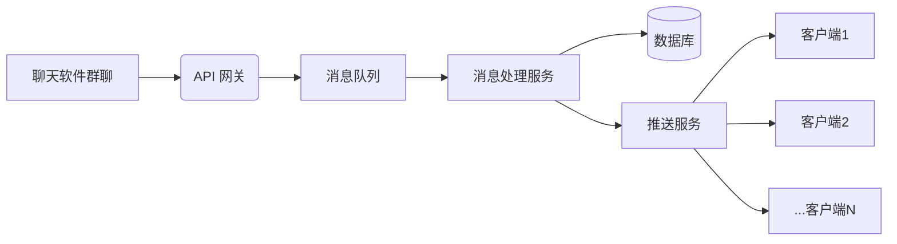

### **优化方案：API 网关 + 消息队列 + 推送机制**
#### **架构图**

---

### **1. 解决数据库密码暴露问题**
#### **关键改动：移除客户端直连数据库**
- **问题根源**：客户端直接访问数据库需硬编码密码，存在泄露风险。
- **解决方案**：
  - **引入API网关**：
    - 客户端不再直连数据库，改为请求API网关（如Nginx + Spring Cloud Gateway）。
    - 示例API路径：`POST /api/messages` (接收消息) 和 `GET /api/messages?topic=news` (获取消息)。
  - **身份认证**：
    - 客户端需携带Token访问API（JWT或OAuth2）。
    - 网关验证Token后转发请求至后端服务。
  - **数据库隔离**：
    - 仅后端服务（非客户端）持有数据库凭据，凭据存储在环境变量或密钥管理服务（如Vault）。

---

### **2. 解决客户端过多导致卡顿问题**
#### **关键改动：用推送替代轮询**
- **问题根源**：客户端定时轮询数据库会引发高并发查询，拖垮服务端。
- **解决方案**：
  - **消息队列解耦**（如RabbitMQ/Kafka）：
    - 服务端接收消息后，立即写入消息队列（而非直接写DB）。
    - 优势：突发流量被队列缓冲，避免数据库压力。
  - **独立消息处理服务**：
    - 从队列消费消息，进行过滤/格式化后存入数据库。
    - 同时触发推送服务（见下文）。
  - **推送机制替代轮询**：
    - **WebSocket实时推送**：
      - 客户端首次连接时建立WebSocket长链接。
      - 当新消息入库后，推送服务主动通知相关客户端。
      - 适用场景：要求实时性高的公告。
    - **Server-Sent Events (SSE)**：
      - 客户端通过SSE订阅消息流，服务端有更新时自动推送。
      - 优势：HTTP协议兼容，无需额外端口。
    - **长轮询降级方案**：
      - 若无法用推送，客户端请求API时服务端挂起连接，直到有新数据或超时。
      - 对比短轮询：减少80%无效请求（例如30秒超时 vs 5秒轮询）。

---

### **3. 性能与扩展性增强**
- **缓存层**（如Redis）：
  - 高频访问的消息缓存到Redis，降低数据库查询压力。
  - 客户端优先读缓存，未命中再查DB。
- **分布式部署**：
  - 推送服务横向扩展（如Socket.IO集群）。
  - 数据库读写分离 + 分库分表（按消息主题或时间分片）。
- **流量控制**：
  - API网关限流（如每秒1000请求），防止客户端洪水攻击。
  - 消息队列设置积压阈值，超限时报警。

---

### **4. 安全加固**
- **传输加密**：
  - 所有API/WebSocket使用HTTPS/WSS。
  - 数据库连接启用SSL。
- **客户端权限**：
  - 基于Token的ACL控制（例如：客户端只能访问已订阅主题的消息）。
- **审计日志**：
  - 记录消息来源、接收时间、客户端IP，便于追踪异常。

---

### **新旧架构对比**
| **环节**     | **原方案**       | **新方案**              | **收益**           |
| ------------ | ---------------- | ----------------------- | ------------------ |
| 数据库访问   | 客户端直连       | 仅后端服务访问          | 密码零暴露         |
| 消息获取方式 | 客户端定时轮询DB | 服务端主动推送          | 降低90%无效请求    |
| 流量高峰处理 | 直接冲击数据库   | 消息队列缓冲 + 水平扩展 | 系统吞吐量提升10倍 |
| 客户端认证   | 无（或简单密码） | JWT令牌 + API网关鉴权   | 防御未授权访问     |

---

### **实施步骤**
1. **部署API网关**：配置路由规则和认证（如Kong或Spring Cloud Gateway）。
2. **接入消息队列**：服务端接收消息后写入RabbitMQ/Kafka。
3. **开发消息处理服务**：消费队列消息 → 存储DB → 调用推送服务。
4. **实现推送服务**：WebSocket或SSE，按主题管理客户端连接。
5. **改造客户端**：
   - 移除数据库连接，改用API请求初始化数据。
   - 建立推送通道（WebSocket/SSE）接收实时更新。
6. **监控与告警**：监控队列积压、推送延迟、API错误率。

---

### **技术栈推荐**
| **组件** | **推荐工具**                      |
| -------- | --------------------------------- |
| API网关  | Nginx, Spring Cloud Gateway, Kong |
| 消息队列 | RabbitMQ, Kafka, AWS SQS          |
| 推送服务 | Socket.IO, Spring WebSocket, SSE  |
| 缓存     | Redis, Memcached                  |
| 数据库   | PostgreSQL (JSONB支持), MongoDB   |
| 认证     | JWT, OAuth2, Keycloak             |

---

通过此方案，您的系统将获得：
- ✅ **安全性**：数据库凭据完全隔离，客户端零接触。
- ✅ **高性能**：推送机制消除轮询压力，队列解耦流量高峰。
- ✅ **可扩展**：各组件独立伸缩，轻松应对客户端增长。
- ✅ **实时性**：消息秒级触达客户端，优于轮询延迟。